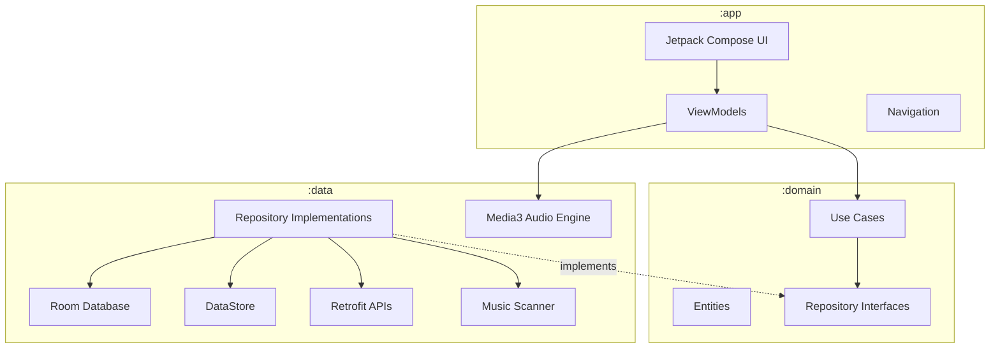
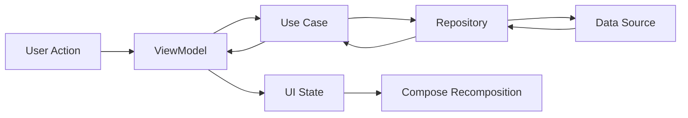
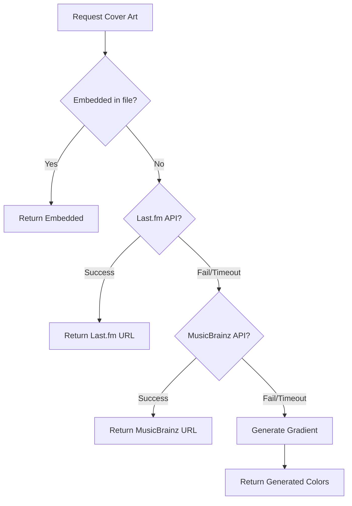
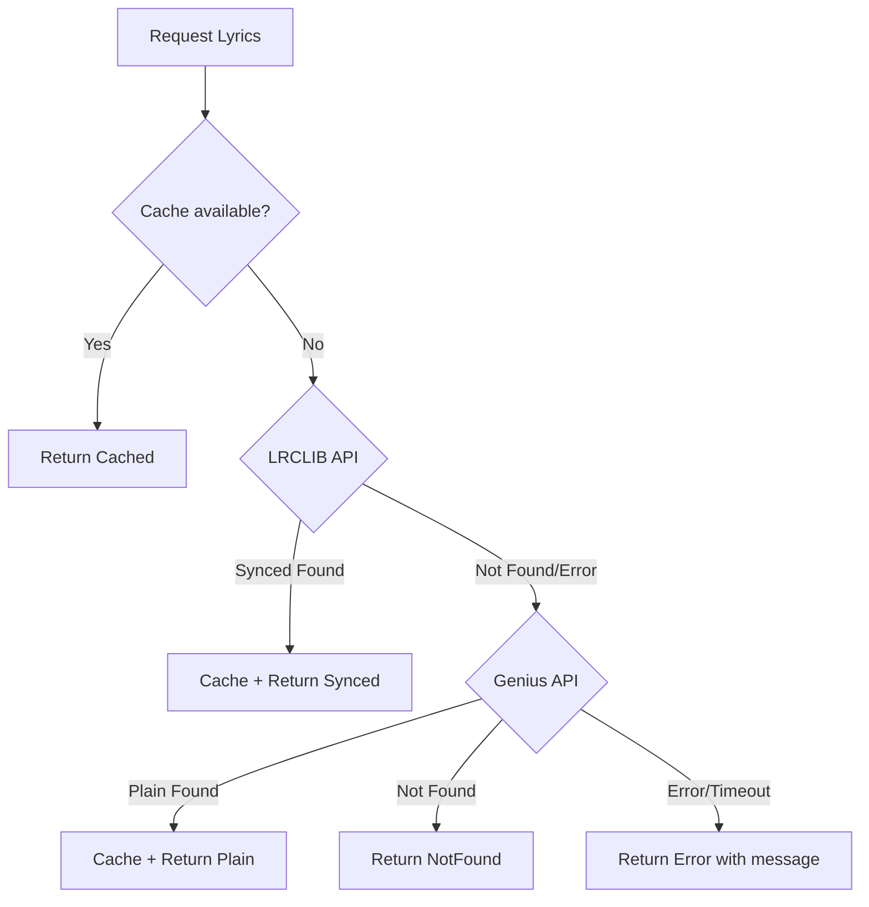

# Design Document — Sonus (com.sonus.player)

## Overview

Sonus es un reproductor de música local profesional para Android, construido con Kotlin nativo y Jetpack Compose. La aplicación sigue Clean Architecture con patrón MVVM, utilizando AndroidX Media3 como motor de audio y Material Design 3 personalizado para una experiencia visual minimalista y elegante.

El alcance de v1.0 incluye: reproducción local completa, carátulas online, letras sincronizadas (LRCLIB + Genius), ecualizador con 5 presets, playlists, historial y sleep timer.

### Principios de Diseño

- **Minimalismo**: Máximo 4-5 elementos por pantalla, 2-3 colores dominantes
- **Rendimiento**: Latencia de reproducción < 100ms, transiciones < 300ms
- **Offline-first**: La música local siempre funciona sin conexión
- **Dark mode optimizado**: Dynamic Color de Material 3 con modo oscuro como experiencia principal

### Stack Tecnológico

| Categoría | Tecnología |
|-----------|-----------|
| Lenguaje | Kotlin |
| UI Framework | Jetpack Compose |
| Arquitectura | Clean Architecture + MVVM |
| Audio Engine | AndroidX Media3 (ExoPlayer) |
| Base de Datos | Room (relational) + DataStore (preferences) |
| DI | Hilt |
| Networking | Retrofit + OkHttp |
| Image Loading | Coil (Compose native) |
| Metadata | MediaStore + JAudioTagger |
| Android Target | minSdk 29 (Android 10), targetSdk 34 (Android 14) |

---

## Architecture

### Estructura de Módulos (3 módulos Gradle)

```
:app          → UI (Compose), ViewModels, Navigation, Hilt setup
:domain       → Entities, Use Cases, Repository interfaces (Kotlin puro, sin Android)
:data         → Room DB, APIs, Repository implementations, Scanner, Audio Engine
```

### Diagrama de Arquitectura



### Flujo de Datos (Unidireccional)



### Decisiones Arquitectónicas

1. **3 módulos, no más**: Simplicidad sobre granularidad excesiva. Un módulo `:domain` puro Kotlin garantiza testabilidad sin Android framework.
2. **Media3 en :data**: El audio engine vive en el módulo data porque interactúa directamente con el sistema Android. Los ViewModels se comunican con él a través de use cases y un PlayerController interface definido en :domain.
3. **Room + DataStore**: Room para datos relacionales (tracks, playlists, historial). DataStore para preferencias simples (tema, último track, EQ preset activo).
4. **Hilt para DI**: Integración nativa con Compose, ViewModels y WorkManager. Scoping por Activity y ViewModel.

---

## Components and Interfaces

### Módulo :domain — Interfaces Clave

```kotlin
// Repositories
interface MusicRepository {
    fun getAllTracks(): Flow<List<Track>>
    fun getTrackById(id: Long): Flow<Track?>
    fun searchTracks(query: String): Flow<List<Track>>
    fun getTracksByAlbum(albumId: Long): Flow<List<Track>>
    fun getTracksByArtist(artistId: Long): Flow<List<Track>>
}

interface PlaylistRepository {
    fun getAllPlaylists(): Flow<List<Playlist>>
    fun getPlaylistWithTracks(id: Long): Flow<PlaylistWithTracks?>
    suspend fun createPlaylist(name: String): Long
    suspend fun addTrackToPlaylist(playlistId: Long, trackId: Long)
    suspend fun removeTrackFromPlaylist(playlistId: Long, trackId: Long)
    suspend fun deletePlaylist(id: Long)
}

interface CoverArtRepository {
    suspend fun getCoverArt(track: Track): CoverArtResult
    suspend fun clearCache()
}

interface LyricsRepository {
    suspend fun getLyrics(track: Track): LyricsResult
    suspend fun getSyncedLyrics(track: Track): SyncedLyricsResult
}
// Cadena: Caché local → LRCLIB (sincronizadas) → Genius (texto plano) → NotFound

interface PlaybackHistoryRepository {
    fun getRecentHistory(limit: Int = 100): Flow<List<HistoryEntry>>
    suspend fun addToHistory(track: Track)
    suspend fun clearHistory()
}

interface PreferencesRepository {
    fun getThemeMode(): Flow<ThemeMode>
    suspend fun setThemeMode(mode: ThemeMode)
    fun getLastPlaybackState(): Flow<SavedPlaybackState?>
    suspend fun savePlaybackState(state: SavedPlaybackState)
    fun getActiveEqPreset(): Flow<EqPreset>
    suspend fun setActiveEqPreset(preset: EqPreset)
}

// Player Controller
interface PlayerController {
    val playbackState: StateFlow<PlaybackState>
    val currentTrack: StateFlow<Track?>
    val progress: StateFlow<PlaybackProgress>
    val queue: StateFlow<List<Track>>
    
    fun play(track: Track)
    fun playQueue(tracks: List<Track>, startIndex: Int = 0)
    fun pause()
    fun resume()
    fun seekTo(positionMs: Long)
    fun next()
    fun previous()
    fun setShuffleEnabled(enabled: Boolean)
    fun setRepeatMode(mode: RepeatMode)
    fun setSleepTimer(durationMs: Long)
    fun cancelSleepTimer()
}

// Equalizer
interface EqualizerController {
    val currentPreset: StateFlow<EqPreset>
    val isEnabled: StateFlow<Boolean>
    fun applyPreset(preset: EqPreset)
    fun setEnabled(enabled: Boolean)
}
```

### Módulo :domain — Use Cases

```kotlin
class GetAllTracksUseCase(private val repo: MusicRepository)
class SearchTracksUseCase(private val repo: MusicRepository)
class GetCoverArtUseCase(private val repo: CoverArtRepository)
class GetLyricsUseCase(private val repo: LyricsRepository)
class GetSyncedLyricsUseCase(private val repo: LyricsRepository)
class ManagePlaylistUseCase(private val repo: PlaylistRepository)
class GetPlaybackHistoryUseCase(private val repo: PlaybackHistoryRepository)
class ScanMusicLibraryUseCase(private val scanner: MusicScannerRepository)
class SavePlaybackStateUseCase(private val repo: PreferencesRepository)
class RestorePlaybackStateUseCase(private val repo: PreferencesRepository)
```

### Módulo :data — Implementaciones Clave

```kotlin
// Music Scanner
class MusicScannerImpl(
    private val contentResolver: ContentResolver,  // MediaStore queries
    private val jAudioTagger: MetadataExtractor    // JAudioTagger wrapper
) : MusicScannerRepository

// Cover Art Resolver (Chain of Responsibility)
class CoverArtResolverImpl(
    private val metadataExtractor: MetadataExtractor,
    private val lastFmApi: LastFmApiService,
    private val musicBrainzApi: MusicBrainzApiService,
    private val gradientGenerator: GradientGenerator
) : CoverArtRepository
// Orden: Embedded → Last.fm → MusicBrainz → Generated gradient

// Lyrics Provider
class LyricsRepositoryImpl(
    private val lrcLibApi: LrcLibApiService,
    private val geniusApi: GeniusApiService,
    private val lyricsDao: LyricsDao  // Cache local
) : LyricsRepository
// Cadena: Cache → LRCLIB (sincronizadas) → Genius (texto plano) → NotFound

// Audio Engine
class Media3PlayerController(
    private val exoPlayer: ExoPlayer,
    private val mediaSession: MediaSession
) : PlayerController
```

### Módulo :app — ViewModels Principales

```kotlin
@HiltViewModel
class PlayerViewModel : ViewModel()      // Playback control, queue, progress
@HiltViewModel  
class LibraryViewModel : ViewModel()     // Track listing, search, albums, artists
@HiltViewModel
class LyricsViewModel : ViewModel()      // Lyrics fetching and sync
@HiltViewModel
class PlaylistViewModel : ViewModel()    // Playlist CRUD
@HiltViewModel
class SettingsViewModel : ViewModel()    // Theme, EQ, preferences
```

### Módulo :app — Pantallas Compose

```kotlin
// Navigation
sealed class Screen(val route: String) {
    object Library : Screen("library")
    object NowPlaying : Screen("now_playing")
    object Lyrics : Screen("lyrics")
    object Playlists : Screen("playlists")
    object Settings : Screen("settings")
}

// Main screens (max 4-5 elements each)
@Composable fun LibraryScreen()       // Track list + search + album grid
@Composable fun NowPlayingScreen()    // Cover art + controls + progress
@Composable fun LyricsScreen()        // Synced lyrics display
@Composable fun PlaylistsScreen()     // Playlist management
@Composable fun SettingsScreen()      // Theme + EQ + Sleep timer + Cache
```

---

## Data Models

### Entidades de Dominio (:domain)

```kotlin
data class Track(
    val id: Long,
    val title: String,
    val artist: String,
    val album: String,
    val albumId: Long,
    val duration: Long,          // milliseconds
    val filePath: String,
    val fileSize: Long,
    val bitrate: Int,
    val sampleRate: Int,
    val format: AudioFormat,
    val trackNumber: Int?,
    val year: Int?,
    val genre: String?
)

enum class AudioFormat { MP3, AAC, FLAC, OGG, WAV }

data class Playlist(
    val id: Long,
    val name: String,
    val createdAt: Long,
    val trackCount: Int
)

data class PlaylistWithTracks(
    val playlist: Playlist,
    val tracks: List<Track>
)

data class HistoryEntry(
    val track: Track,
    val playedAt: Long
)

data class PlaybackState(
    val isPlaying: Boolean,
    val currentTrack: Track?,
    val positionMs: Long,
    val durationMs: Long,
    val shuffleEnabled: Boolean,
    val repeatMode: RepeatMode,
    val sleepTimerRemainingMs: Long?
)

data class PlaybackProgress(
    val positionMs: Long,
    val durationMs: Long,
    val bufferedPositionMs: Long
)

data class SavedPlaybackState(
    val trackId: Long,
    val positionMs: Long,
    val queueTrackIds: List<Long>,
    val queueIndex: Int,
    val shuffleEnabled: Boolean,
    val repeatMode: RepeatMode
)

enum class RepeatMode { OFF, ONE, ALL }
enum class ThemeMode { LIGHT, DARK, SYSTEM }

data class EqPreset(
    val name: String,           // "Rock", "Pop", "Classical", "Jazz", "Flat"
    val bands: List<Float>      // Band gains in dB
)

// Cover Art
sealed class CoverArtResult {
    data class Embedded(val bytes: ByteArray) : CoverArtResult()
    data class Remote(val url: String) : CoverArtResult()
    data class Generated(val colors: List<Int>) : CoverArtResult()
    object NotFound : CoverArtResult()
}

// Lyrics
sealed class LyricsResult {
    data class Found(val text: String) : LyricsResult()
    object NotFound : LyricsResult()
    data class Error(val message: String) : LyricsResult()
}

sealed class SyncedLyricsResult {
    data class Found(val lines: List<SyncedLine>) : SyncedLyricsResult()
    object NotFound : SyncedLyricsResult()
    data class Error(val message: String) : SyncedLyricsResult()
}

data class SyncedLine(
    val text: String,
    val startTimeMs: Long,
    val endTimeMs: Long?
)
```

### Room Database Schema (:data)

```kotlin
@Entity(tableName = "tracks")
data class TrackEntity(
    @PrimaryKey val id: Long,
    val title: String,
    val artist: String,
    val album: String,
    val albumId: Long,
    val duration: Long,
    val filePath: String,
    val fileSize: Long,
    val bitrate: Int,
    val sampleRate: Int,
    val format: String,
    val trackNumber: Int?,
    val year: Int?,
    val genre: String?,
    val lastScannedAt: Long
)

@Entity(tableName = "playlists")
data class PlaylistEntity(
    @PrimaryKey(autoGenerate = true) val id: Long = 0,
    val name: String,
    val createdAt: Long
)

@Entity(
    tableName = "playlist_tracks",
    primaryKeys = ["playlistId", "trackId"],
    foreignKeys = [
        ForeignKey(entity = PlaylistEntity::class, parentColumns = ["id"], childColumns = ["playlistId"], onDelete = ForeignKey.CASCADE),
        ForeignKey(entity = TrackEntity::class, parentColumns = ["id"], childColumns = ["trackId"], onDelete = ForeignKey.CASCADE)
    ]
)
data class PlaylistTrackCrossRef(
    val playlistId: Long,
    val trackId: Long,
    val position: Int,
    val addedAt: Long
)

@Entity(tableName = "playback_history")
data class HistoryEntity(
    @PrimaryKey(autoGenerate = true) val id: Long = 0,
    val trackId: Long,
    val playedAt: Long
)

@Entity(tableName = "lyrics_cache")
data class LyricsCacheEntity(
    @PrimaryKey val trackId: Long,
    val plainText: String?,
    val syncedJson: String?,    // JSON serialized List<SyncedLine>
    val fetchedAt: Long
)

@Entity(tableName = "cover_art_cache")
data class CoverArtCacheEntity(
    @PrimaryKey val albumId: Long,
    val sourceType: String,    // "embedded", "lastfm", "musicbrainz", "generated"
    val url: String?,
    val colors: String?,       // JSON for generated gradients
    val fetchedAt: Long
)

@Database(
    entities = [TrackEntity::class, PlaylistEntity::class, PlaylistTrackCrossRef::class, 
                HistoryEntity::class, LyricsCacheEntity::class, CoverArtCacheEntity::class],
    version = 1
)
abstract class SonusDatabase : RoomDatabase() {
    abstract fun trackDao(): TrackDao
    abstract fun playlistDao(): PlaylistDao
    abstract fun historyDao(): HistoryDao
    abstract fun lyricsDao(): LyricsDao
    abstract fun coverArtDao(): CoverArtDao
}
```

### DataStore Preferences (:data)

```kotlin
// Keys stored in DataStore
object PreferenceKeys {
    val THEME_MODE = stringPreferencesKey("theme_mode")           // "light"|"dark"|"system"
    val ACTIVE_EQ_PRESET = stringPreferencesKey("active_eq")     // Preset name
    val EQ_ENABLED = booleanPreferencesKey("eq_enabled")
    val LAST_TRACK_ID = longPreferencesKey("last_track_id")
    val LAST_POSITION_MS = longPreferencesKey("last_position_ms")
    val LAST_QUEUE_JSON = stringPreferencesKey("last_queue")     // JSON serialized queue
    val LAST_QUEUE_INDEX = intPreferencesKey("last_queue_index")
    val SHUFFLE_ENABLED = booleanPreferencesKey("shuffle_enabled")
    val REPEAT_MODE = stringPreferencesKey("repeat_mode")
    val EXCLUDED_FOLDERS = stringSetPreferencesKey("excluded_folders")
}
```

### API Services (:data)

```kotlin
// Last.fm API
interface LastFmApiService {
    @GET("2.0/")
    suspend fun getAlbumInfo(
        @Query("method") method: String = "album.getinfo",
        @Query("artist") artist: String,
        @Query("album") album: String,
        @Query("api_key") apiKey: String,
        @Query("format") format: String = "json"
    ): LastFmAlbumResponse
}

// MusicBrainz API
interface MusicBrainzApiService {
    @GET("release/")
    suspend fun searchRelease(
        @Query("query") query: String,
        @Query("fmt") format: String = "json"
    ): MusicBrainzSearchResponse
    
    @GET("release/{id}/front")
    suspend fun getCoverArt(@Path("id") releaseId: String): ResponseBody
}

// LRCLIB API (letras sincronizadas, gratuita, sin API key)
interface LrcLibApiService {
    @GET("api/get")
    suspend fun getSyncedLyrics(
        @Query("artist_name") artist: String,
        @Query("track_name") trackName: String,
        @Query("album_name") albumName: String?,
        @Query("duration") duration: Int?
    ): LrcLibResponse
}

// Genius API (letras texto plano, gratuita con API key)
interface GeniusApiService {
    @GET("search")
    suspend fun searchSong(
        @Query("q") query: String,
        @Header("Authorization") token: String
    ): GeniusSearchResponse
}
```

---

## Correctness Properties

*A property is a characteristic or behavior that should hold true across all valid executions of a system—essentially, a formal statement about what the system should do. Properties serve as the bridge between human-readable specifications and machine-verifiable correctness guarantees.*

### Property 1: Playback state reflects current track metadata

*For any* valid Track entity, when playback is initiated on that track, the resulting PlaybackState should contain the same track reference with its title, artist, and duration matching the original Track.

**Validates: Requirements 1.3**

### Property 2: Pause preserves position and track

*For any* PlaybackState where isPlaying is true, invoking pause() should produce a state where isPlaying is false, currentTrack remains the same, and positionMs is unchanged.

**Validates: Requirements 1.4**

### Property 3: Queue navigation correctness

*For any* queue of N tracks (N > 1) and any current index i, calling next() should advance to index (i+1) mod N, and calling previous() should move to index (i-1+N) mod N, with the resulting currentTrack matching the track at the new index.

**Validates: Requirements 1.5**

### Property 4: Cover art resolution chain ordering

*For any* Track, the CoverArtResolver should attempt sources in strict order: embedded metadata first, then Last.fm API, then MusicBrainz API, and finally gradient generation. If a source succeeds, no subsequent source should be consulted.

**Validates: Requirements 3.2, 3.6**

### Property 5: Cover art selects highest resolution

*For any* set of cover art candidates returned by an API source with varying resolutions, the selected image should have a resolution greater than or equal to all other candidates in the set.

**Validates: Requirements 3.3**

### Property 6: Synced lyrics line selection

*For any* list of SyncedLine objects (ordered by startTimeMs) and any playback position P, the highlighted line should be the line L where L.startTimeMs <= P and (the next line's startTimeMs > P or L is the last line).

**Validates: Requirements 4.2**

### Property 7: Playlist round-trip integrity

*For any* valid playlist name and any non-empty set of Track IDs, creating a playlist with that name and adding those tracks should result in a retrievable PlaylistWithTracks containing exactly those track IDs in the added order.

**Validates: Requirements 5.3**

### Property 8: Shuffle produces complete permutation

*For any* queue of N distinct tracks with shuffle enabled, the shuffle result should be a permutation containing all N tracks exactly once (same elements, no duplicates, no omissions).

**Validates: Requirements 5.4**

### Property 9: History bounded buffer

*For any* sequence of M track plays (M > 100), the playback history should contain exactly 100 entries, representing the 100 most recently played tracks in reverse chronological order.

**Validates: Requirements 5.5**

### Property 10: Playback state serialization round-trip

*For any* valid SavedPlaybackState, serializing it to DataStore and then deserializing it back should produce an equivalent SavedPlaybackState (same trackId, positionMs, queueTrackIds, queueIndex, shuffleEnabled, repeatMode).

**Validates: Requirements 5.6**

### Property 11: Scanner directory filtering

*For any* set of directories on the device and any configuration of excluded folders, the scanner should return tracks exclusively from directories that are either standard media directories or user-permitted directories, and should never include tracks from excluded directories.

**Validates: Requirements 6.3, 6.4**

### Property 12: Scanner resilience to corrupt files

*For any* set of files where some are valid music files and some are corrupt/unreadable, the scanner should return all valid tracks successfully and exclude corrupt files, without throwing an exception or halting the scan.

**Validates: Requirements 6.6**

---

## Error Handling

### Estrategia por Capa

| Capa | Tipo de Error | Manejo |
|------|--------------|--------|
| :data (Network) | Timeout, HTTP errors, no connectivity | Retry con backoff exponencial (3 intentos). Retorno de resultado cacheado si disponible. |
| :data (Database) | Room exceptions, migration failures | Logging + graceful degradation. Si Room falla, la app sigue funcionando sin persistencia temporal. |
| :data (Scanner) | Archivos corruptos, permisos denegados | Skip del archivo, log del error, continuar con siguiente. Nunca interrumpir scan completo. |
| :data (Audio) | Formato no soportado, archivo dañado | Notificación al usuario vía UI state, auto-skip a siguiente track en queue. |
| :domain (Use Cases) | Datos inválidos, estados inconsistentes | Validación en entrada del use case. Retorno de sealed class Result con error descriptivo. |
| :app (ViewModel) | Cualquier excepción no manejada | Catch global en ViewModel scope, emisión de error state para UI. |
| :app (UI) | Error state recibido | Snackbar o dialog informativo, opción de reintentar cuando aplica. |

### Patrones de Error

```kotlin
// Sealed result pattern usado en :domain
sealed class Result<out T> {
    data class Success<T>(val data: T) : Result<T>()
    data class Error(val message: String, val cause: Throwable? = null) : Result<Nothing>()
}

// Error states en ViewModels
data class UiState<T>(
    val data: T? = null,
    val isLoading: Boolean = false,
    val error: String? = null
)
```

### Cover Art Error Chain



### Lyrics Error Handling



### Políticas de Retry

- **APIs (Last.fm, MusicBrainz, LRCLIB, Genius)**: 3 intentos, backoff exponencial (1s, 2s, 4s)
- **Scanner de archivos**: Sin retry (skip y continuar)
- **Room operations**: Sin retry (error inmediato, logging)
- **Media3 playback**: 1 retry para errores transitorios, skip para errores permanentes

---

## Testing Strategy

### Enfoque Dual: Unit Tests + Property Tests

La estrategia de testing combina tests de ejemplo específicos con property-based tests que verifican propiedades universales.

### Property-Based Testing

**Librería**: [Kotest Property Testing](https://kotest.io/docs/proptest/property-based-testing.html)

**Configuración**:
- Mínimo 100 iteraciones por property test
- Cada test referencia su property del documento de diseño
- Tag format: `Feature: professional-music-player, Property {number}: {title}`

**Properties a implementar**:

| Property | Módulo Target | Generadores Necesarios |
|----------|--------------|----------------------|
| 1: Playback state metadata | :app (ViewModel) | Arb.track() |
| 2: Pause preserves state | :app (ViewModel) | Arb.playbackState() |
| 3: Queue navigation | :domain (Use Case) | Arb.list(Arb.track()), Arb.int(range) |
| 4: Cover art chain | :data (Repository) | Arb.track(), mock responses |
| 5: Cover art resolution | :data (Repository) | Arb.list(Arb.coverArtCandidate()) |
| 6: Synced lyrics line | :domain (Use Case) | Arb.list(Arb.syncedLine()), Arb.long() |
| 7: Playlist round-trip | :data (Repository) | Arb.string(), Arb.list(Arb.long()) |
| 8: Shuffle permutation | :domain (Use Case) | Arb.list(Arb.track(), 2..100) |
| 9: History bounded buffer | :data (Repository) | Arb.list(Arb.track(), 101..500) |
| 10: State serialization | :data (DataStore) | Arb.savedPlaybackState() |
| 11: Scanner dir filtering | :data (Scanner) | Arb.set(Arb.path()), Arb.set(Arb.path()) |
| 12: Scanner corruption | :data (Scanner) | Arb.list(Arb.fileDescriptor()) |

### Unit Tests (Example-Based)

| Área | Tests Clave |
|------|------------|
| EQ Presets | 5 presets existen con valores correctos de bandas |
| Permission flow | UI de explicación cuando permiso denegado |
| Format detection | Identificación correcta de MP3, AAC, FLAC, OGG, WAV |
| Theme switching | Light/Dark/System aplica correctamente |
| Sleep timer | Timer expira y pausa reproducción |
| Cache clearing | Clearing elimina datos de Room tables |

### Integration Tests

| Área | Tests Clave |
|------|------------|
| Media3 playback | Reproducción end-to-end de cada formato soportado |
| MediaStore query | Descubrimiento de archivos con ContentResolver mock |
| Retrofit APIs | Llamadas a Last.fm, MusicBrainz, LRCLIB, Genius con MockWebServer |
| Room migrations | Migración de schema sin pérdida de datos |
| Metadata extraction | JAudioTagger lee ID3v2, Vorbis, APE tags correctamente |

### UI Tests

| Área | Tests Clave |
|------|------------|
| Navigation | Transiciones entre las 5 pantallas principales |
| NowPlaying | Cover art + controles + progreso renderizados |
| Library | LazyColumn con thumbnails carga correctamente |
| Lyrics | Línea sincronizada resaltada correctamente |

### Estructura de Test Directories

```
:app/src/test/         → ViewModel unit tests
:app/src/androidTest/  → Compose UI tests
:domain/src/test/      → Use case + entity property tests
:data/src/test/        → Repository property tests (con mocks)
:data/src/androidTest/ → Room + integration tests
```
